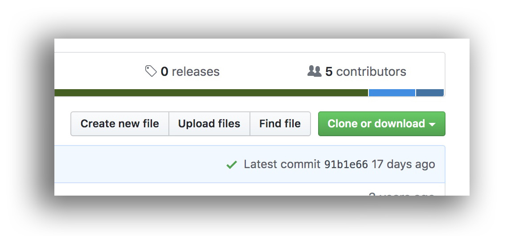
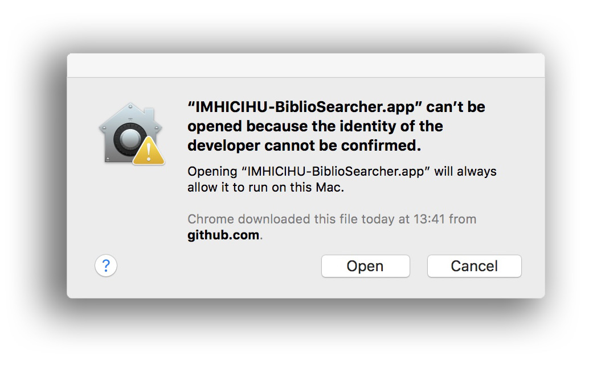

### Github
* Go to the `Releases` tab right above the green `clone/download` button

* Download the most recent build file _e.g_: `IMHICIHU-biblio-searcher.dmg` file
* Open it up and drag it to your `Applications` folder
* If you get an error about an unidentified developer, <kbd>⌃ Control</kbd>-click the app and hit `Open`

### Mac security

* If you get a warning that `IMHICIHU-biblio-searcher.dmg` can't be opened due to an unidentified developer you have to make sure that under `System Preferences` > `Security & Privacy` > `General` it is allowed to open apps from the `Mac App Store and identified developers`. Then try to open `IMHICIHU-biblio-searcher.dmg` and under `System Preferences` > `Security & Privacy` > `General` click on `Open Anyway`
