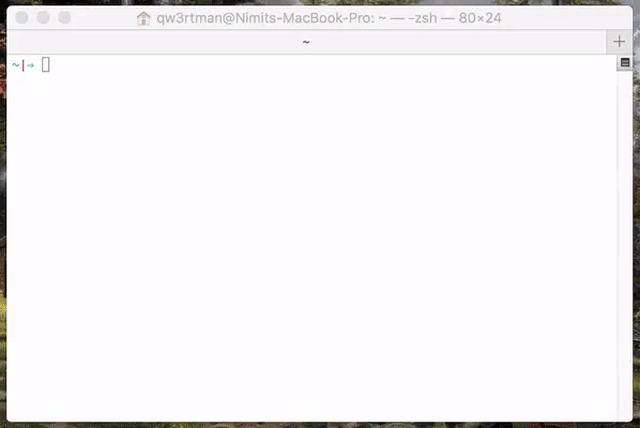

### User login
* https://auth0.com/universal-login/
### Checksum
* Verify your downloads: SHA-1 CHECKSUM


```
959ae06f369493dd1bea44695715d5e4599ab2b9  IMHICIHU-Searcher-3.1.0.ga-1.i386.rpm
a9da7e15c9db870af654e8b5462e47839b55b07f  IMHICIHU-Searcher-3.1.0.ga-1.x86_64.rpm
a016f0824dcfb791adadd564ef4c287bc4dfaa1d  IMHICIHU-Searcher_3.1.0.ga_amd64.deb
bb9d81a93f63b4bca4ecca7d7da47c49889685fd  IMHICIHU-Searcher-3.1.0.ga.dmg
46e951408c17b09bd24aa6b5118eea2f08e316c6  IMHICIHU-Searcher_3.1.0.ga_i386.deb
777b77f993d2b859677fe260fecec000f6ea6eec  IMHICIHU-Searcher-3.1.0.ga-i386.exe
483bd366e9b5f7e996bb06c18e214eb051803254  IMHICIHU-Searcher-3.1.0.ga-x86_64.exe
```

### Internal searcher
* [Algolia indices](https://github.com/electron/algolia-indices/)
* [Fuzzy search](https://fusejs.io/) algorithm (comes in Javascript flavour!)
### Accessibility
* [How to Design for Screen Readers with Adobe XD CC](https://www.sitepoint.com/how-to-design-for-screen-readers-with-adobe-xd-cc/?utm_source=feedly)
* [OpenDislexic](https://opendyslexic.org/)
### NPM
* https://docs.npmjs.com/getting-started/fixing-npm-permissions   (take in count to fix some...)
* [n - interactively Manage Your Node.js Versions](https://github.com/tj/n)
<BR></BR>

<BR></BR>
### Character map (at request)
* [React character map](https://github.com/Dayjo/react-character-map): to allow international characters in the search query
<BR></BR>

<BR></BR>
### Linux app store
* [SnapCraft](https://snapcraft.io/)
### Database
* https://rxdb.info/ >> real time database, even offline mode (take in count in the RoadMap)
* https://github.com/bengotow/electron-RxDB
### Crash reporting
* [Socorro](https://github.com/mozilla/socorro): _Vide_ https://github.com/electron/mini-breakpad-server
### Datatables 
* ~~https://toni-heittola.github.io/js-datatable/   (some kind of realtime database, look for the built-in searcher)~~
* https://bit.dev/components?q=datatables
### Distribution
* Check [Chocolatey](https://chocolatey.org/docs/create-packages) automation on Windows environment
### Updater
* https://github.com/PhilippLgh/electron-app-manager
### Codesign-in app in MacOSX
* https://github.com/electron/electron-osx-sign (use this first!)
* https://github.com/electron-userland/electron-osx-sign/
### Notarizing macOS Software Before Distribution
* https://developer.apple.com/documentation/xcode/notarizing_macos_software_before_distribution?preferredLanguage=occ
### FAQ (bot)
* [Impossiblebot](https://impossible.bot/)
### Miscellaneous
* [Why not to build an Electron App](https://medium.com/shipmnts/why-not-to-build-an-electron-app-92b2f5a99d33)